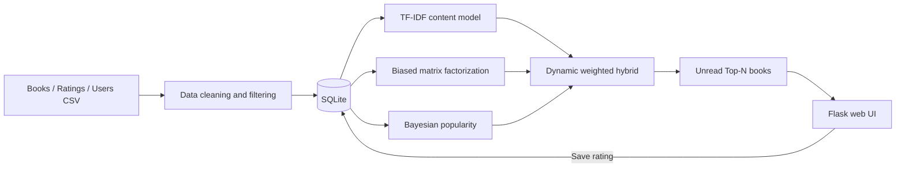

# BOOK-LOG - Implementation, Evaluation and Conclusion

Tài liệu này hoàn thiện các phần 4-7 tiếp theo của
`docs/Bookstore recommendation system.docx.md`.

## 4. Implementation

### Development environment

- Ngôn ngữ: Python 3.12+.
- Xử lý dữ liệu: pandas, NumPy, SciPy.
- Machine learning: scikit-learn.
- Web backend: Flask.
- Database: SQLite.
- User interface: HTML and CSS.
- Dataset: Kaggle Book Recommendation Dataset; `data/processed` dùng để chạy local.

### System architecture



### Main components

1. **Data pipeline (`mainproject/booklog/data.py`)**  
   Chuẩn hóa schema, loại ISBN trùng, sửa kiểu dữ liệu năm/rating, loại rating
   không hợp lệ và lọc các user/book quá thưa trước khi huấn luyện.

2. **Content-based model (`mainproject/booklog/content.py`)**  
   Tạo metadata từ title, author, publisher và year; vector hóa bằng TF-IDF
   unigram/bigram; cosine similarity sinh item-to-item recommendation và hồ sơ
   sở thích của user. Tìm kiếm gần đúng xử lý trường hợp nhập tên như
   "Lord of The Ring".

3. **SQLite persistence (`mainproject/booklog/database.py`)**  
   Tự tạo schema và nhập dữ liệu CSV vào ba bảng `books`, `users`, `ratings`
   trong lần chạy đầu. Website đọc dữ liệu runtime từ SQLite và dùng upsert để
   lưu hoặc cập nhật rating của reader.

4. **Collaborative model (`mainproject/booklog/collaborative.py`)**  
   Cài đặt matrix factorization có global mean, user bias, item bias và latent
   vectors. Các tham số được tối ưu bằng SGD với L2 regularization.

5. **Dynamic hybrid (`mainproject/booklog/hybrid.py`)**  
   Trộn content score và collaborative score bằng trọng số:

   ```text
   alpha = number_of_user_ratings / (number_of_user_ratings + 10)
   final = 0.9 * (alpha * CF + (1 - alpha) * Content) + 0.1 * Popularity
   ```

   User mới có `alpha = 0`; khi lịch sử tăng, mô hình chuyển dần sang CF. Sách
   đã đọc và sách chọn trong onboarding được loại khỏi kết quả.

### User interface

Giao diện được xây dựng đơn giản bằng Flask, HTML và CSS trên một trang:

- Hiển thị catalog sách.
- Tìm kiếm theo tên sách hoặc tác giả.
- Chọn reader profile hoặc sách yêu thích để nhận hybrid recommendation.
- Hiển thị tỷ lệ match của từng recommendation.
- Lưu hoặc cập nhật rating sách của reader vào SQLite.

Chạy `python app.py`, sau đó mở `http://127.0.0.1:5000`.

## 5. Evaluation and Discussion

### Evaluation design

- Chỉ dùng explicit ratings (`Book-Rating > 0`).
- Với mỗi user có ít nhất ba rating, giữ lại ngẫu nhiên một rating làm test.
- Huấn luyện lại mô hình trên phần còn lại.
- **RMSE và MAE:** đo sai số dự đoán rating.
- **HitRate@K:** tỷ lệ sách relevant bị giữ lại xuất hiện trong Top-K.
- **Precision@K:** tỷ lệ hit trên tổng số vị trí recommendation.
- Rating từ 7/10 trở lên được xem là relevant.

### Evaluation results

Kết quả kiểm tra khả năng chạy end-to-end trên dataset đã lọc:

| Metric | Result |
|---|---:|
| RMSE | 1.1060 |
| MAE | 0.9360 |
| HitRate@5 | 0.5000 |
| Precision@5 | 0.1000 |
| Test ratings | 12 |

Đây là kết quả tham khảo từ giai đoạn đánh giá mô hình, không phải chức năng cần
chạy trong bản demo frontend/backend.

### Discussion

- Content-based giải quyết tốt item-to-item và cold-start nhưng metadata của bộ
  dữ liệu chỉ có title/author/publisher, chưa có synopsis hoặc genre nên mức hiểu
  ngữ nghĩa còn giới hạn.
- Matrix factorization tìm được latent preference nhưng phụ thuộc mật độ rating.
- Dynamic alpha tránh áp dụng collaborative quá mạnh cho user mới.
- Popularity score 10% giúp kết quả ổn định khi content profile còn rỗng.
- Leave-one-out phản ánh bài toán Top-N tốt hơn random row split, nhưng cần thêm
  diversity, novelty, coverage và A/B test trước khi triển khai thực tế.

## 6. Conclusion

### Insight

Một thuật toán đơn lẻ không xử lý đồng thời được sparsity, cold-start và nhu cầu
khám phá. Hybrid recommendation cho phép hệ thống dùng metadata khi chưa biết
nhiều về người dùng, sau đó chuyển dần sang hành vi cộng đồng khi lịch sử đủ dày.

### Experience and realization

- Làm sạch và lọc dữ liệu ảnh hưởng trực tiếp đến chất lượng hơn việc tăng số
  latent factors một cách máy móc.
- Không nên dùng chung một trọng số hybrid cố định cho mọi user.
- Đánh giá rating prediction chưa đủ; hệ thống thực tế phải đo chất lượng Top-N.
- Bước tiếp theo có giá trị nhất là bổ sung genre/synopsis, tuning bằng validation
  set và đánh giá diversity/novelty trên toàn bộ dữ liệu Kaggle.

## 7. References

1. Arash Nic, *Book Recommendation Dataset*, Kaggle, CC0 1.0.
2. Yehuda Koren, Robert Bell, Chris Volinsky, *Matrix Factorization Techniques
   for Recommender Systems*, IEEE Computer, 2009.
3. Francesco Ricci, Lior Rokach, Bracha Shapira, *Recommender Systems Handbook*,
   Springer.
4. scikit-learn documentation: TF-IDF Vectorizer and cosine similarity.
5. Flask documentation.
