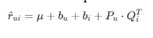

# BOOK-LOG

## The Bookstore Recommendation System

Team: **The Nonchalants**  
Goal: recommend suitable books for existing and new readers.

---

## 1. Introduction

Readers face information overload in large online bookstores.

BookLog helps by:

- reducing time spent searching
- personalizing book discovery
- supporting both known readers and new readers

---

## 2. Problem Description and Modeling

We model recommendations as a **user-book matrix**:

- each row is a user
- each column is a book
- each known value is an explicit rating from 1 to 10

The matrix is sparse: the processed dataset has **1,500 books**, **234 users**
and **12,118 ratings**, leaving about **96.5%** of entries empty.

---

## 3. Mathematical Modeling

Collaborative Filtering uses biased Matrix Factorization to estimate missing
ratings.



The prediction combines global average, user bias, book bias and latent user-book
preference vectors.

---

## 4. Optimization and Loss Function

The model is trained with Stochastic Gradient Descent by minimizing regularized
squared error.


Regularization helps reduce overfitting on sparse rating data.

---

## 5. Recommendation by Our Idea

BookLog uses a **dynamic weighted hybrid system**:

- Content-Based Filtering: TF-IDF on title, author, publisher and year
- Collaborative Filtering: Matrix Factorization from explicit ratings
- Popularity fallback: keeps weak profiles stable

```text
alpha = rating_count / (rating_count + 10)
final = 0.9 * (alpha * CF + (1 - alpha) * Content) + 0.1 * Popularity
```

New users rely more on content. Active users rely more on collaborative signals.

---

## 6. Implementation

Backend:

- Flask app
- SQLite database
- hybrid recommender modules

Frontend:

- one HTML page
- CSS book catalog and recommendation form

Demo flow:

1. Search books.
2. Select a reader or enter a favorite book.
3. Show hybrid recommendations.
4. Save rating updates to SQLite.

---

## 7. Evaluation and Discussion

Results on the processed dataset:

| Metric | Result |
|---|---:|
| RMSE | 1.4551 |
| MAE | 1.1050 |
| HitRate@10 | 0.0500 |
| Precision@10 | 0.0050 |

Discussion:

- Matrix Factorization learns useful rating patterns.
- Content-Based Filtering helps cold-start users.
- Top-N ranking still needs improvement.

---

## 8. Conclusion

A single method is not enough for personalization, sparsity and cold start.

BookLog combines:

- metadata similarity
- matrix-factorization prediction
- popularity fallback
- persistent SQLite rating updates

Future work: add genre/synopsis data and improve ranking diversity.
